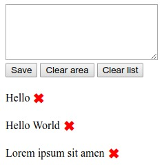

# Todo List example

The `todo-list-example` folder have a simple JS code example. 

The code is asynchronous, without any libraries. Native JS only.  

All data is stored in the browser to the user through indexedDB and localStorage. Also made descriptions of functions, using comments to the code. 

----------------------------------

# Unit and integration testing

The `test-Unit-Integrational-E2E` folder contains different copies of the test code. Maybe you can use them as a sample to write test code.

### Built With

* chai
* mocha
* nyc
* sinon

### Running the tests

For runing mocka tests 
> npm run watch

If you want to see the percentage of code test coverage
> npm run coverage
